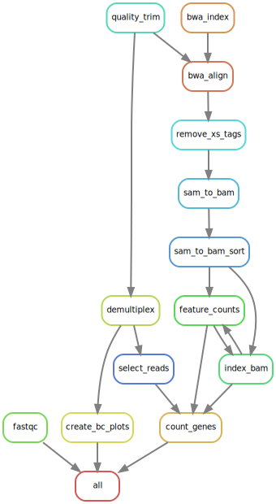

# Petrisnake: A secondary analysis pipeline for PETRI-seq data.

This is a Snakemake pipeline for the secondary computational analysis of single cell RNA-seq data from the PETRI-seq protocol (https://www.nature.com/articles/s41564-020-0729-6 and https://www.nature.com/articles/s41586-024-08124-2).

# Dependencies

